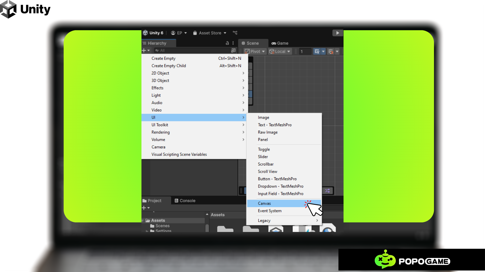
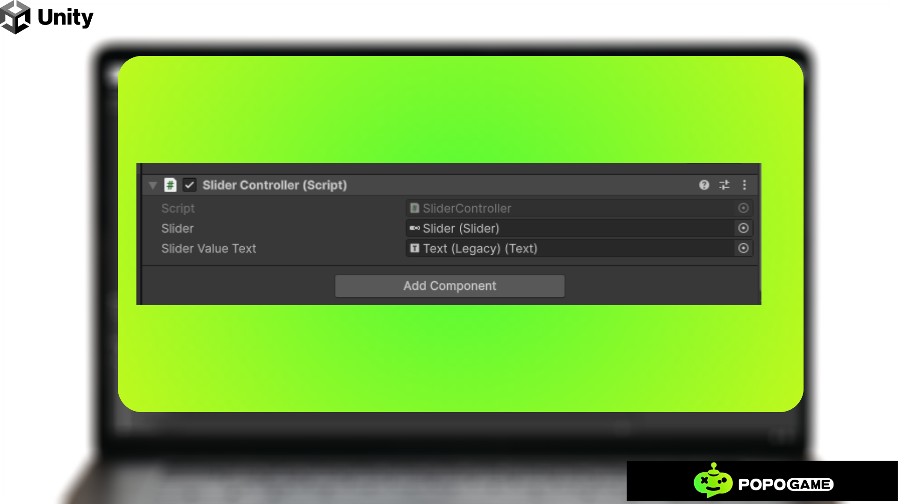

# How-To-Make-Unity-Slider

Creating a slider in Unity is a useful feature for many types of games or apps. You can use a slider to represent values like volume control, brightness, or health. Below is a step-by-step tutorial for creating a simple UI slider in Unity using both C# code and Unity's UI system.

# Step 1: Setting Up the Unity Project
**1. Create a New Project:**
  - Open Unity Hub and click on "New Project."
  - Select a template (e.g., 2D or 3D) and click "Create."

**2. Set Up the Scene:**
  - Once inside the Unity editor, you should be in the Scene view. If not, open it from the Window menu > General > Scene.

# Step 2: Add a Canvas
Unity UI elements, such as sliders, must be inside a **Canvas.**

**1. Create the Canvas:**
  - In the **Hierarchy** window, right-click and select **UI > Canvas.** This will create a new Canvas object.
  - The Canvas is used to render UI elements like buttons, text, sliders, etc.

# Step 3: Create the Slider

**1. Create the Slider:**
  - Right-click on the Canvas in the Hierarchy and select UI > Slider.
  - This creates a Slider GameObject under the Canvas.

**2.** You'll see the Slider in the Hierarchy window, and in the Scene window, it will appear as a horizontal bar with a draggable knob.

**3. Adjust the Slider:**
  - Select the Slider object in the Hierarchy.
  - In the Inspector window, you can modify the slider's properties, such as:
    - Min Value and Max Value: Define the range of the slider (e.g., 0 to 100).
    - Value: Defines the current value of the slider.
    - Whole Numbers: Check this if you want the value to be in whole numbers.
   
  
# Step 4: Customize the Slider (Optional)

**1. Change the Appearance:**

  - In the **Inspector,** expand the **Slider (Script)** component. You can see **Handle Slide Area** (for the draggable knob) and **Background** (for the bar background).
  - You can change the colors or replace these objects with custom sprites by selecting each one and dragging in a new image or color.

# Step 5: Create a Script to Control the Slider Value
Now, you’ll create a simple C# script that will control the slider value and display it.

**1. Create the Script:**
  - In the **Project** window, right-click in the **Assets** folder and select **Create > C# Script.**
  - Name the script SliderController.
  - Double-click the script to open it in your code editor.

**2. Write the Script:**

**Explanation:**

- slider: A reference to the Slider component.
- sliderValueText: A reference to the Text component where the slider value will be displayed.
- OnSliderValueChanged: This method updates the displayed value whenever the slider is moved.

# Step 6: Link the Slider and Text to the Script
**1. Create a Text Object:**

  - Right-click on the **Canvas** in the **Hierarchy** and select **UI > Text**. This will create a new Text GameObject.
  - Adjust the position of the Text object so it appears near the slider.
  - You can change the font size, alignment, and text color in the Inspector.

**2. Attach the Script:**

  - Select the **Slider** GameObject in the **Hierarchy.**
  - In the **Inspector**, click **Add Component** and search for SliderController (the script you created). Add it to the slider.

**3. Link the References:**

  - After adding the script, you’ll see two fields in the Inspector for Slider and Slider Value Text.
  - Drag the **Slider** GameObject from the **Hierarchy** into the Slider field in the Inspector.
  - Drag the **Text** GameObject from the **Hierarchy** into the Slider Value Text field in the Inspector.

# Step 7: Test the Slider in Play Mode
**1. Enter Play Mode:**

  - Click the **Play** button at the top of the screen to enter Play Mode.
  - Move the slider and watch the value displayed next to it change in real-time.

Creating a slider in Unity is a useful feature for many types of games or apps. You can use a slider to represent values like volume control, brightness, or health. Below is a step-by-step tutorial for creating a simple UI slider in Unity using both C# code and Unity's UI system.

# Step 8: Final Adjustments and Conclusion
**1. Fine-Tuning:**

  - You can add more functionality to the slider, such as limiting its range, setting initial values, or using the slider to control game settings like volume or brightness.
**2. Exit Play Mode:**
    
  - Click the Play button again to exit Play Mode and save your scene.

# Summary of Key Steps:
1. Create a **Canvas** and **Slider**.
2. Write a C# script to update the slider's value.
3. Link the **Slider** and **Text** to the script.
4. Test and make adjustments as needed.
This tutorial covers the basics of creating a simple slider in Unity. You can expand upon this by adding more functionality, such as animating the slider or using it to interact with other game elements.
